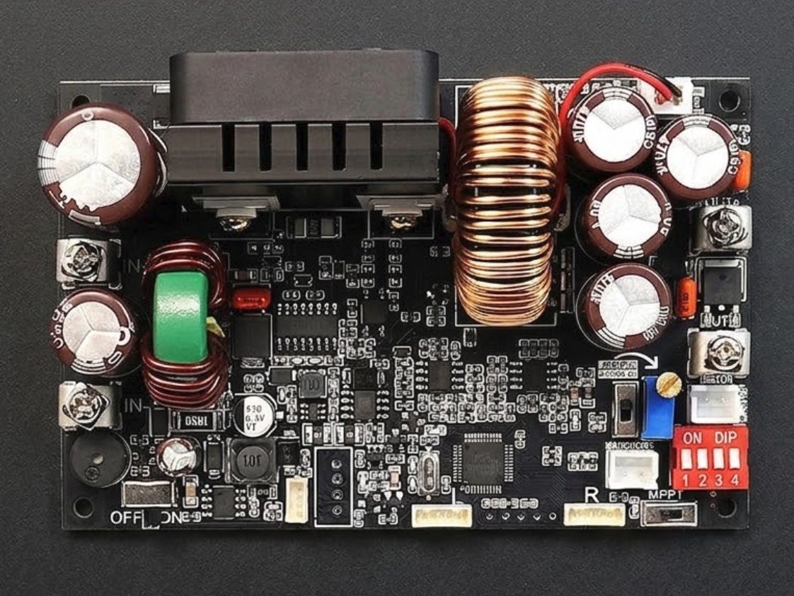

# xy-modbus



Modbus-RTU driver for the XY-series programmable buck converters
(XY7025, XY6020L, XY6015, XY-SK60, XY-SK120, XY-SK120X). These modules
share a common register layout — the differences between models are
mechanical (max V/A/W), not protocol.

> **Hardware verification:** only the XY7025 has been tested against
> real hardware (see `examples/esp32c6-test/`). The other models are
> supported on the basis of the shared register layout documented by
> third-party reverse engineering, but are **unverified** — use
> `Model::Custom` and report back if you try one.

`no_std`, no required dependencies. Bring your own UART transport, or
opt in to the bundled one (default `embedded-io` feature) or the
`esp-idf-hal` glue.

## Usage

```rust,ignore
use xy_modbus::{Model, SafetyLimits, Xy};

let mut xy = Xy::new(my_transport, Model::Xy7025);

xy.set_protection(SafetyLimits {
    lvp_v: 22.0,
    ovp_v: 15.0,
    ocp_a: 15.0,
})?;
xy.set_voltage(13.5)?;
xy.set_current_limit(10.0)?;
xy.set_output(true)?;

let s = xy.read_status()?;
println!("{:.2} V @ {:.2} A", s.v_out, s.i_out);
```

`Model` selects per-register scales (I-OUT, POWER, S-OCP, S-OPP) — the
wrong family silently shifts current and power readings by 10×. Call
`xy.verify_model()?` at boot to catch a misconfiguration against the
device's `MODEL` register.

## Using with `esp-idf-hal`

Enable the `esp-idf-hal` feature and skip writing any glue:

```toml
[dependencies]
xy-modbus = { version = "0.1", features = ["esp-idf-hal"] }
```

```rust,ignore
use xy_modbus::{Model, Xy};

let mut xy = Xy::from_esp_uart(uart, Model::Xy7025);
xy.set_voltage(13.5)?;
```

`from_esp_uart` wraps an `esp_idf_hal::uart::UartDriver` with the
default XY-series timing (500 ms response window, 50 ms inter-frame
gap). For non-default timing, build the transport manually:

```rust,ignore
use xy_modbus::{uart::UartTransport, Model, Xy};
use esp_idf_hal::delay::FreeRtos;

let transport = UartTransport::new(uart, FreeRtos).with_timing(750, 100);
let xy = Xy::new(transport, Model::Xy7025);
```

The `esp-idf-hal` feature is target-conditional — enabling it on host
targets (e.g. `cargo test --all-features`) is a no-op, so this is safe
to leave on in shared `Cargo.toml` files.

## Bringing your own transport

Two entry points, in increasing order of effort:

### 1. Use the bundled `UartTransport` (default `embedded-io` feature)

`UartTransport<U, D>` needs `U: BlockingRead + embedded_io::Write` and
`D: embedded_hal::delay::DelayNs`. `BlockingRead` is one method —
`fn read(&mut self, buf: &mut [u8], timeout_ms: u32) -> Result<usize, _>` —
that translates to your HAL's native blocking-with-timeout read.
Typical impl is 3 lines:

```rust,ignore
use xy_modbus::BlockingRead;

impl BlockingRead for MyUart {
    type Error = MyError;
    fn read(&mut self, buf: &mut [u8], timeout_ms: u32) -> Result<usize, Self::Error> {
        self.read_with_timeout(buf, Duration::from_millis(timeout_ms as u64))
    }
}
```

> **Heads up for esp-idf-hal users without the `esp-idf-hal` feature**:
> if you import `embedded-io` directly to write your own transport, pin
> it in your `Cargo.toml` to disambiguate against the `0.6.x` version
> that `embassy-sync` pulls in transitively:
>
> ```toml
> embedded-io = "0.7"
> ```
>
> Otherwise `use embedded_io::Write` may resolve to the wrong version
> and produce confusing trait-resolution errors against `UartDriver`'s
> `0.7` impl. The `esp-idf-hal` feature avoids this by keeping all
> embedded-io use inside the crate.

### 2. Implement `ModbusTransport` directly

Skip embedded-io entirely. The `framing` module exposes the on-wire
codec (`build_*` / `parse_*` / `crc16_modbus`); a typical impl is
under 100 lines:

```rust,ignore
use xy_modbus::{framing, ModbusTransport, RtuError};

struct MyTransport { /* uart handle, timing config */ }

impl ModbusTransport for MyTransport {
    fn read_holding(&mut self, slave: u8, addr: u16, dst: &mut [u16])
        -> Result<(), RtuError>
    {
        let req = framing::build_read_request(slave, addr, dst.len() as u16);
        let mut buf = [0u8; framing::MAX_ADU];
        let n = self.transact(&req, &mut buf)?;
        framing::parse_read_response(&buf[..n], slave, dst)?;
        Ok(())
    }
    // write_single_holding, write_multiple_holdings analogous
    # fn write_single_holding(&mut self, _: u8, _: u16, _: u16) -> Result<(), RtuError> { unimplemented!() }
    # fn write_multiple_holdings(&mut self, _: u8, _: u16, _: &[u16]) -> Result<(), RtuError> { unimplemented!() }
}
```

The transport implementer owns UART timing — inter-frame gap, response
timeout, post-write quiet gap. The XY-series wants ~50 ms between
frames and ~500 ms response window; see [`DATASHEET.md`](DATASHEET.md)
§2 for empirical values.

## What's in the API

- **Live readings** — `read_status`, `read_setpoints`,
  `read_voltage_out` / `_in`, `read_current_out`, `read_power_out`,
  `read_temperatures`, `read_totals`
- **Setpoints** — `set_voltage`, `set_current_limit`,
  `set_protection` / `read_protection`, `set_power_on_output`
- **Output control** — `set_output` / `read_output`,
  `read_protection_status` / `clear_protection_status`,
  `read_reg_mode`
- **Front panel & misc** — `read/set_lock`, `read/set_backlight`,
  `read/set_sleep_minutes`, `read/set_buzzer`,
  `read/set_temp_unit`, `read_temp_offset_*`
- **Identity & comms** — `read_model`, `verify_model`, `read_version`,
  `read/set_slave_address`, `read/set_baud_rate`
- **Memory groups (M0–M9)** — `read_group(n)`, `write_group(n, &p)`,
  `recall_group(n)`

WiFi-pairing block (registers 0x0030–0x0034) is documented in the
datasheet but not yet exposed at the high-level API.

## Boot / safety policy

This crate exposes the device protocol; it intentionally does **not**
prescribe a power-on / fault-recovery policy. See [`DATASHEET.md`](DATASHEET.md)
§7 for the recommended bring-up checklist (program protection
*before* raising V-SET, force OUTPUT_EN off until verification
passes, etc.) — translate that into the routine that fits your
application.

## Cargo features

| Feature       | Default | Purpose                                                                    |
|---------------|---------|----------------------------------------------------------------------------|
| `embedded-io` | yes     | Bundled `UartTransport` over `BlockingRead + embedded_io::Write`.         |
| `esp-idf-hal` | no      | `Xy::from_esp_uart(uart, model)` constructor for `esp_idf_hal::UartDriver`.|
| `defmt`       | no      | `defmt::Format` derives on public types.                                   |
| `serde`       | no      | `Serialize`/`Deserialize` derives on public types.                         |

## Protocol reference

See [`DATASHEET.md`](DATASHEET.md) for the full register map, CRC
algorithm, wire-level examples, and known firmware quirks.

## Examples

### `examples/esp32c6-test/` — on-device test suite for XY7025

A full sweep-test that exercises every public API method against a real
XY7025, runnable on an ESP32-C6 via `esp-idf`. UART1 @ 115200 8N1 on
GPIO16 (TX → XY RX) / GPIO17 (RX ← XY TX), shared GND.

26 tests covering:

- All live reads (status, setpoints, output V/I/P, V_IN, totals,
  temperatures) cross-checked against each other.
- Setpoint sweeps: 20 V values across 0–70 V, 14 I values across 0–25 A,
  6 protection (LVP/OVP/OCP) combinations.
- Output enable/disable plumbing (V_SET=0 / I_SET=0 first — disconnect
  any sensitive load).
- Front-panel registers (lock, backlight, sleep, buzzer, temp unit) with
  sweep-and-restore.
- Identity (model / version / `verify_model`), comms read-back, plus
  same-value writes to slave-address / baud-rate to exercise the setter
  codepaths without orphaning the bus.
- Every M0–M9 memory group: probe-write → read-back → restore.
- Constructor / destructor lifecycle: `into_transport` →
  `Xy::with_slave` → `verify_model` on the rebuilt instance.
- **Raw transport probes** for S-OTP, T-IN-OFFSET, SLEEP — these
  bypass the driver's fixed-point conversion and call
  `ModbusTransport` directly to document the firmware-side quirks
  found while building this suite (S-OTP scale=1, T-OFFSET writes
  silently dropped, SLEEP capped at 9 min).

The suite snapshots every writable register at start and restores it at
end, so it's safe to re-run on a unit you actually use.

```sh
cd examples/esp32c6-test
./flash.sh           # cargo build --release && espflash flash --monitor
```

The example is a standalone Cargo project (its own
`rust-toolchain.toml`, `sdkconfig.defaults`, `.cargo/config.toml`) and
is not pulled into the parent crate's build — running `cargo test` /
`cargo build` from the crate root ignores it.

## License

MIT OR Apache-2.0.
